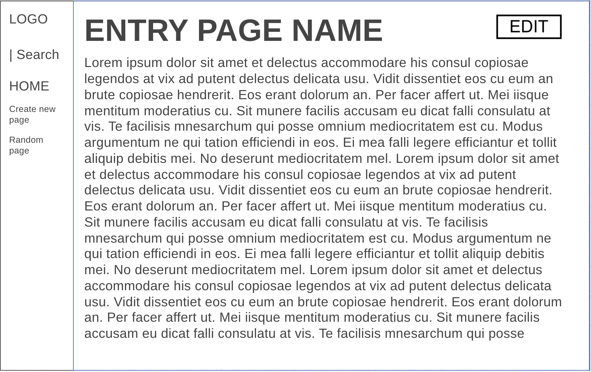

# Libri

TODO: Describe your application here.

## Getting Started

TODO: Describe steps to install requirements and get the application running.

## Design Document

For this project a couple of function are required to make sure that everything works as intended.

### Entry Pages
This is the main function which essentially displays the contents of each wiki page that exists.

Those pages can be accessed via /wiki/"pagename" which needs to be defined in the urls.py. This pagename has to be used to find the required information to display on the screen. In views.py a function has to be made to view the data appropriatly if the data is indeed there. To check if a page can be rendered, an if else statement is needed to check if the get_entry function in utils.py, which retrieves entry files, doesn't return a none value (which indicates that info of a page isn't found).

For this operation we essentially will need two pages namely:
* *Normal page*
By using the get_entry function in the util.py file, the markdown file can be found and loaded. 
This markdown file needs to be converted to HTML format to make sure it can be showed on the screen. The output of this needs to be stored in a new template file specifically for the entry pages.

Example:

* *Error page*
If the file cannot be found then the user needs to be redirected to an error page which needs to have a specific view function complete with an URL and HTML template.

Example:

