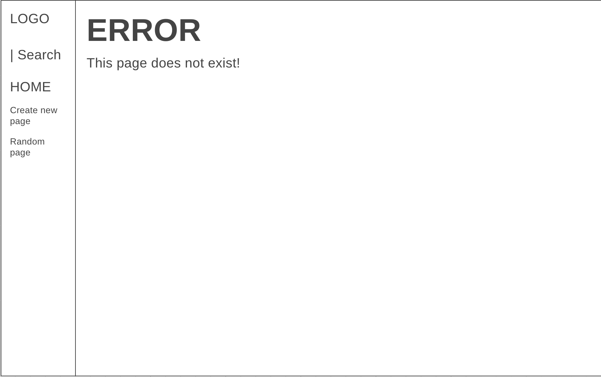
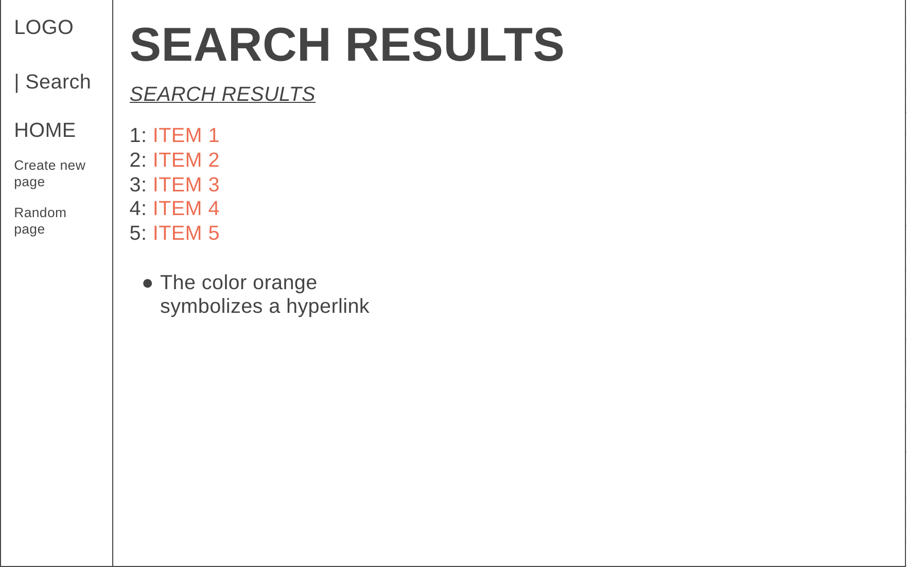

# Libri

This website is a encyclopedia where users can find information about certian topics which are stored as markdown files in the entries map.


## Getting Started

To run this program Python is required with the following libaries:
* Django 
    ```pip install Django```
* Markdown2
    ```pip install Markdown2```

## Design Document

For this project a couple of function are required to make sure that everything works as intended.

### Entry Pages
This is the main function which essentially displays the contents of each wiki page that exists.

Those pages can be accessed via /wiki/"pagename" which needs to be defined in the urls.py. This pagename has to be used to find the required information to display on the screen. In views.py a function has to be made to view the data appropriatly if the data is indeed there. To check if a page can be rendered, an if else statement is needed to check if the get_entry function in utils.py, which retrieves entry files, doesn't return a none value (which indicates that info of a page isn't found).

For this operation we essentially will need two HTML pages namely:
* **Normal page**

By using the get_entry function in the util.py file, the markdown file can be found and loaded. 
This markdown file needs to be converted to HTML format, using the markdown2 libary of Python, to make sure it can be showed on the screen. The output of this needs to be stored in a new template file specifically for the entry pages.
The page also houses a edit button which redirects the user to a page where the page can be editted.

Example:


* **Error page**

If the file cannot be found then the user needs to be redirected to an error page which needs to have a specific view function complete with an URL and HTML template.

Example:


### Index Page

The index page, or the homepage, has been already delivered in a minimalistic form.
It needs to be updated so that every entry, that can be retrieved using the list_entries function in the utils.py, has a hyperlink which links to their entry page. In order to make this work a change in the template file of the index will be neccesary.

Example:


### Search Page

The search page allows users to search for information of a certain subject. If the user enters something that matches up with the name of one of the entries then the user is immediately redirected to that entry page. The get_entry function can be used for that. 
It also needs to list entries if a part of the searchterm is in a name of a file. These entries, together with their hyperlink, need to be listed on a new page and thus a new HTML template. This list can not be retrieved by using the get_entry function, since it requires full names. So a method to find these entries need to be made in views.py. If there are no entries with the added synonyms, an error message needs to be shown instead.

* **Search result page**

Example:


* **Search result page error**

Example:


### New Page
The user should also be able to add new pages to the website via the button of the naviagation bar. This button needs to be redirected to a new HTML page which requires a new template. It should house a textarea where the user can type in his new page; a textarea to name the new page and a save button. 

The information in the textarea needs to be POSTed to the page which can store the new page and convert it to a new markdown file. It should give an error if the name given already exists. This needs to be added to a the new function specifically made for this page in views.py.

The user should be redirected to the page that the user just made.

Example:


### Edit Page
The user should also be able to add edit existing pages via the button of available on every entry page. This button needs to be redirected to a new HTML page which requires a new template. It should house a textaream, with the default value of the existing page, where the user can edit the page and a save button. 

The information in the textarea needs to be POSTed to the page which can store the new page and convert it to a markdown file which will overwrite the old markdown file. This needs to be added to a the new function specifically made for this page in views.py.

The user should be redirected to the page that the user just changed.

Example:


### Random Page
This button present in the navigation bar needs to redirect the user to a random page available. By clicking on the button a function need to be called which lists each available page and then pick one for the user. Then the page of that entry need to be called.

## Workflow diagram
